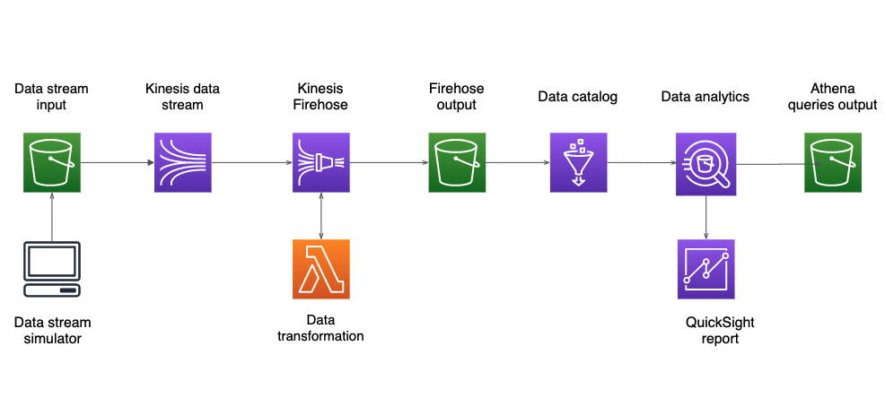

# Kinesis streaming

## Overview

This repo consists of:
- A python script that simulates a data stream of events
- Terraform files that contain the infrastructure code
- Lambda for the Firehose data transformation
- SQL queries that enable us to get insights from the data
- A report (analysis) in QuickSight that provides visualizations
- Unit tests for the code

## Architecture

## Requirements

In order to be able to run the code, the following is needed:
- `python 3.9.3`
- `virtualenv`
- `terraform` (installation link: https://learn.hashicorp.com/tutorials/terraform/install-cli)
- an `AWS account`, with `QuickSight` account

## Setup

- Clone the repository: \
`git clone git@github.com:jvasilevska/python_kinesis.git`

- Copy config.ini.example to config.ini with the following command: \
`cp config.ini.example config.ini`

- Add your credentials for the AWS account, as well as all other required variables in `config.ini`

- Copy .tfvars.example to .tfvars with the following command: \
`cp .tfvars.example .tfvars`

- Add your credentials for the AWS account in `.tfvars`

- Create new environment: `python3 -m venv env` 
- Activate the environment: 
	- Windows: `env\Scripts\activate` 
	- Mac: `source env/bin/activate` 
- Install requirements: `pip3 install -r requirements.txt` 

- When done, deactivate environment: 
	- Windows: `env\Scripts\deactivate.bat` 
	- Mac: `deactivate`

Running the project: \
`terraform -chdir=infra init -var-file=.tfvars`     - initiates Terraform \
`./tf_deploy.sh` 												- deploys the Terraform  code from the project \
`python3 data_stream_generator.py`							    - runs the script (events.json file must already be uploaded in S3 bucket) 

If necessary, in order to destroy the AWS resources created with Terraform: \
`terraform -chdir=infra destroy -var-file=.tfvars`

Running the tests: \
`python3 -m unittest discover tests`

